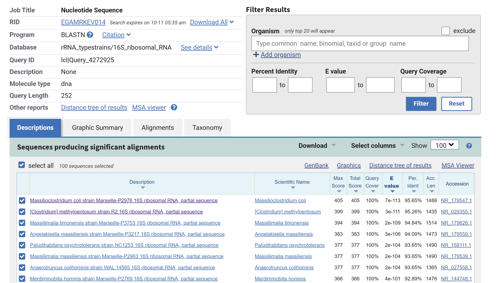
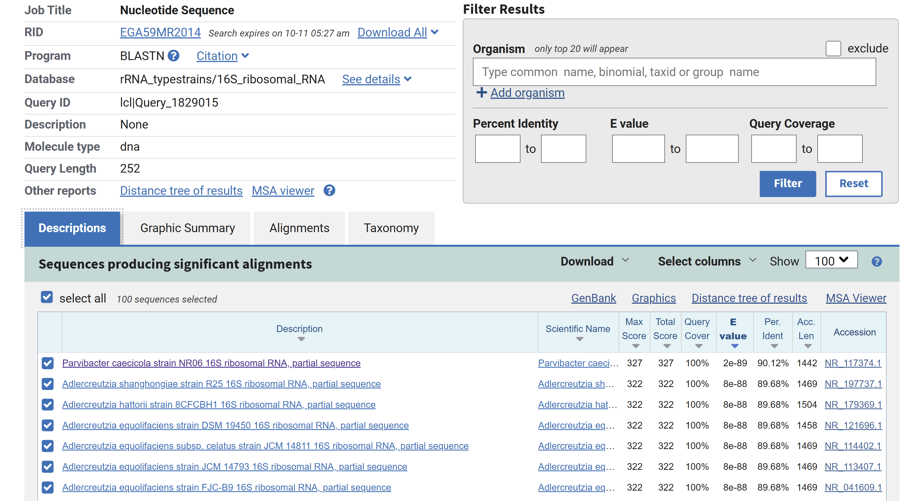

```{r setup, include=FALSE}
knitr::opts_chunk$set(echo = TRUE)
```

## Data Retrieval
download.file(url = "https://mothur.s3.us-east-2.amazonaws.com/wiki/miseqsopdata.zip", destfile = "~/Labs/BIOL4315_Lab5/data/miseqsopdata.zip")
unzip("~/Labs/BIOL4315_Lab5/data/miseqsopdata.zip", exdir = "~/Labs/BIOL4315_Lab5/data")
download.file(url = "https://zenodo.org/record/4587955/files/silva_nr99_v138.1_wSpecies_train_set.fa.gz?download=1", destfile = "~/Labs/BIOL4315_Lab5/data/silva_nr99_v138.1_wSpecies_train_set.fa.gz")

gunzip silva_nr99_v138.1_wSpecies_train_set.fa.gz

```{r Required_Libraries, include = FALSE}
lapply(c("dada2","phyloseq","vegan","tidyverse", "Biostrings"), library, character.only = T)
```
```{r Variables, include = FALSE}
data_dir <- "~/Labs/BIOL4315_Lab5/data/MiSeq_SOP"
fnFs <- sort(list.files(data_dir, pattern="_R1_001.fastq", full.names = TRUE))
fnRs <- sort(list.files(data_dir, pattern="_R2_001.fastq", full.names = TRUE))
sample.names <- stringr::str_split_fixed(basename(fnFs),"_",2)[,1]
```
# Question 1
```{r Quality_Control_Visualize}
plotQualityProfile(fnFs[1:19])
plotQualityProfile(fnRs[1:19])
```

mkdir filtered

```{r Filter_Trim}
filtFs <- file.path("~/Labs/BIOL4315_Lab5/data/filtered", paste0(sample.names, "_F_filt.fastq.gz"))
names(filtFs) <- sample.names
filtRs <- file.path("~/Labs/BIOL4315_Lab5/data/filtered", paste0(sample.names, "_R_filt.fastq.gz"))
names(filtRs) <- sample.names
out <- filterAndTrim(fnFs, filtFs, fnRs, filtRs, truncLen=c(240,160), maxN=0, maxEE=c(2,2), truncQ = 2 ,rm.phix=TRUE, compress=TRUE, multithread = TRUE)
```
# Question 2

```{r Denoising, warning = FALSE}
errF <- learnErrors(filtFs, multithread=T)
errR <- learnErrors(filtRs, multithread=T)
plotErrors(errF, nominalQ=TRUE)
plotErrors(errR, nominalQ=TRUE)
dadaFs <- dada(filtFs, err=errF, multithread = TRUE)
dadaRs <- dada(filtRs, err=errF, multithread = TRUE)
```

The error frequencies of the forward and reverse reads look similar.

# Merge Paired Ends
```{r PE_Merging}
mergers <- mergePairs(dadaFs, filtFs, dadaRs, filtRs, verbose=TRUE)
```
# Frequency Table

```{r Sequence_Table}
seqtab <- makeSequenceTable(mergers)
seqtab.nochim <- removeBimeraDenovo(seqtab, method="consensus", multithread=F, verbose=TRUE)
```
# Sanity Check

```{r Sanity_Check}
getN <- function(x){ 
  sum(getUniques(x))
}
track <- cbind(out, sapply(dadaFs, getN), sapply(dadaRs, getN), sapply(mergers, getN), rowSums(seqtab.nochim))
colnames(track) <- c("input", "filtered", "denoisedF", "denoisedR", "merged", "nonchim")
rownames(track) <- sample.names
track <- as.data.frame(track) %>% mutate(prop_kept = round(nonchim/input*100,2))
DT::datatable(track)
```

# Polishing Frequency Table

```{r Polishing_1}
ASV_tbl <- as.data.frame(seqtab.nochim) %>% `colnames<-`(base::paste("ASV", seq(1:ncol(seqtab.nochim)), sep = ""))
ASV_tbl <- as.data.frame(t(ASV_tbl[-nrow(ASV_tbl),]))
ASV_tbl <- ASV_tbl %>% mutate(rs = rowSums(ASV_tbl)) %>% filter(rs > 0) %>% dplyr::select(-rs)
DT::datatable(ASV_tbl, options = list(scrollX = TRUE, autoWidth = TRUE))
ASV_seqs <- DNAStringSet(base::colnames(seqtab.nochim) %>% `names<-`(base::paste("ASV",seq(1:ncol(seqtab.nochim)),sep = "")))
```
# Assign Taxonomy

```{r Assign_Taxonomy}
taxa <- assignTaxonomy(seqtab.nochim, "~/Labs/BIOL4315_Lab5/data/silva_nr99_v138.1_wSpecies_train_set.fa.gz", multithread=TRUE)
taxa2 <- as.data.frame(taxa) %>% `row.names<-`(base::paste("ASV", seq(1:nrow(taxa)), sep = ""))
DT::datatable(taxa2,options = list(scrollX = TRUE, autoWidth = TRUE))
```

# Polishing Taxonomy Table

```{r Polishing_2}
taxa2 <- taxa2 %>% filter(Family != "Mitochondria") %>% filter(Order != "Chloroplast")
taxa3 <- taxa2 %>% mutate(ASVs = row.names(taxa2)) %>% dplyr::select(ASVs, everything())
ASV_tbl2 <- ASV_tbl %>% mutate(ASVs=row.names(ASV_tbl)) %>% dplyr::select(ASVs, everything())
taxa3 <- taxa3 %>% inner_join(ASV_tbl2, by = "ASVs")
taxa2 <- taxa2 %>% filter(rownames(taxa2)%in%taxa3$ASVs)
ASV_tbl <- ASV_tbl %>% filter(row.names(ASV_tbl) %in% taxa3$ASVs)
taxa3[,(ncol(taxa2)+2):ncol(taxa3)] <- sweep(taxa3[,(ncol(taxa2)+2):ncol(taxa3)],2, colSums(taxa3[,(ncol(taxa2)+2):ncol(taxa3)]),'/')*100

```
# Exporting Microbiome

```{r Microbiome}
ASV_seqs[names(ASV_seqs)%in%ASV_tbl2$ASVs]
writeXStringSet(ASV_seqs[names(ASV_seqs)%in%ASV_tbl2$ASVs], "~/Labs/BIOL4315_Lab5/output/microbiome.fasta")
```
# Question 3

ASV184 Firmicutes and ASV207 Actinobacteriota could not be resolved down to genus/species.

ASV184

TACGTAGGGAGCAAGCGTTGTCCGGAATTACTGGGTGTAAAGGGAGCGTAGGCGGGAGGATAAGTTGAATGTGAAATCTA
TGGGCTCAACCCATAGCTGCGTTCAAAACTGTTCTTCTTGAGTGAAGTAGAGGCAGGCGGAATTCCTAGTGTAGCGGTGA
AATGCGTAGATATTAGGAGGAACACCAGTGGCGAAGGCGGCCTGCTGGGCTTTTACTGACGCTGAGGCTCGAAAGCGTGG
GTAGCAAACAGG

ASV207

TACGTAGGGGGCGAGCGTTATCCGGATTCATTGGGCGTAAAGCGCGCGCAGGCGGACTCATAAGCGGAGCCTTTAATCTT
GGGGCTTAACCTCAAGTCGGGCCCCGAACTGTGAGTCTCGAGTGTGGTAGGGGAAGGCGGAATTCCCGGTGTAGCGGTGG
AATGCGCAGATATCGGGAAGAACACCGATGGCGAAGGCAGCCTTCTGGGCCATCACTGACGCTGAGGCGCGAAAGCTAGG
GGAGCAAACAGG


Using a BLAST search of the sequences the following results were obtained:




The top hits for ASV184 and ASV207 were _M. coli_ and _P. caecicola_ respectively.


# Phyloseq

```{r Phyloseq}
mdta <- read.delim(base::paste(data_dir,"mouse.dpw.metadata", sep = "/" ))
mdta <- mdta %>% mutate(category = if_else(dpw > 100 , "Late","Early")) %>% mutate(gender = if_else(str_detect(group, "F"),"F","M")) %>% mutate(subject = str_extract(str_split_fixed(group, "D", 2)[,1],"(\\d)+")) %>% `row.names<-`(mdta$group)
ps <- phyloseq(otu_table(as.matrix(ASV_tbl), taxa_are_rows=T), sample_data(mdta), tax_table(as.matrix(taxa2)))
ps <- merge_phyloseq(ps, ASV_seqs)
ps
```

# Alpha Diversity

# Question 4 & 5

```{r Alpha_Diversity, warning = FALSE}
rnd <- estimate_richness( ps, measures=c("Observed", "ACE","Shannon", "Simpson")) %>% dplyr::select(-se.ACE)
DT::datatable(rnd[1:2])
df = as.data.frame(rnd[1:2])
write.csv(df, "~/Labs/BIOL4315_Lab5/output/alpha_diversity.csv")
rnd <- rnd %>% mutate(group = row.names(rnd))%>% inner_join(mdta, "group")
rndl <- rnd %>% gather("Estimator", "Value", 1:4) %>% mutate(rd = if_else(Estimator == "Observed" | Estimator == "ACE", "Richness","Diversity"))
library("RColorBrewer")
p <- ggplot(rndl, aes(x=dpw, y=Value, color = Estimator, fill = Estimator))+
  geom_bar(stat = "identity", position = position_dodge())+
  facet_grid(rd~category, scales = "free")
p + theme_bw() + scale_fill_brewer(palette = "Dark2") + scale_color_brewer(palette = "Greys")
```

